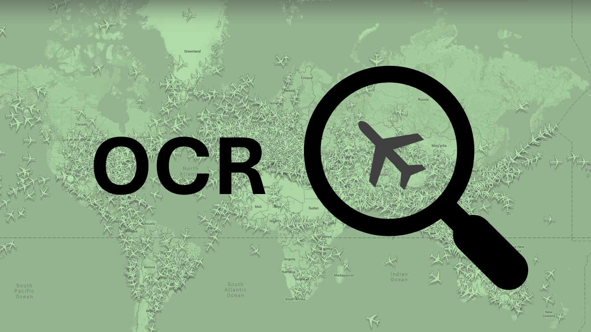
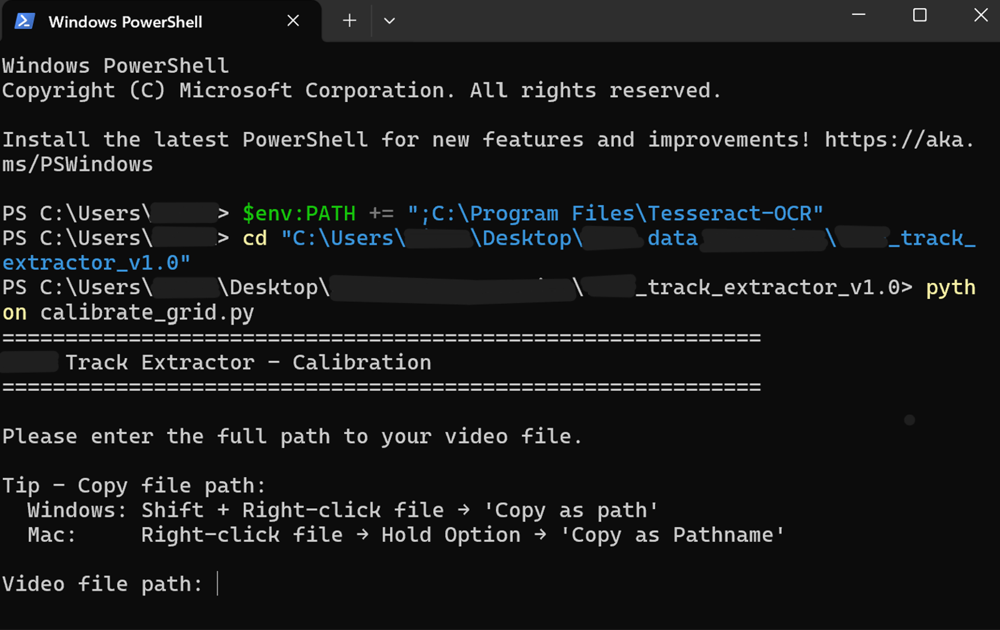
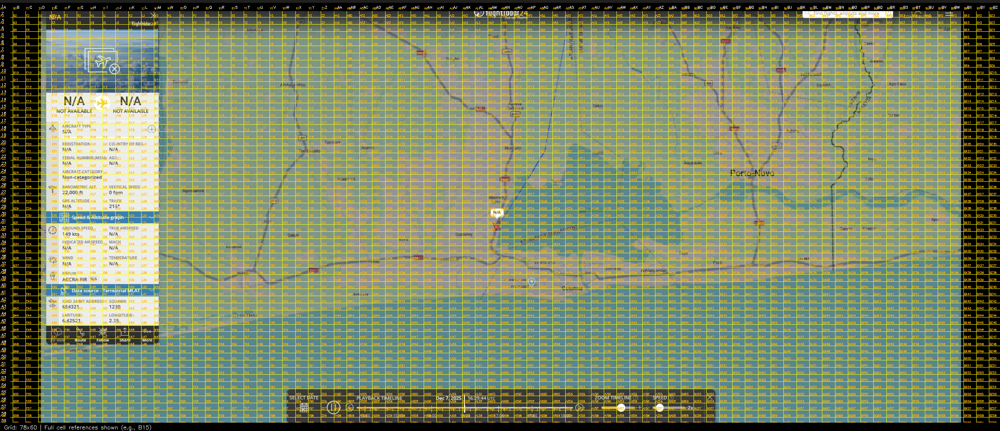
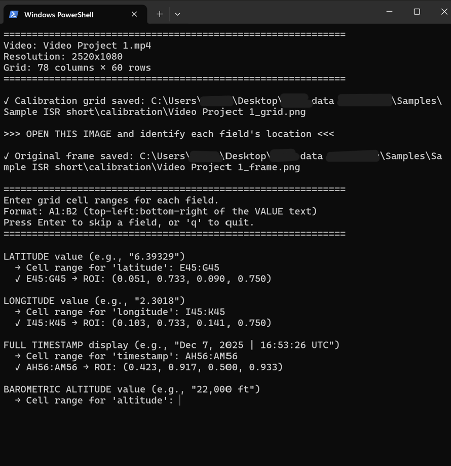
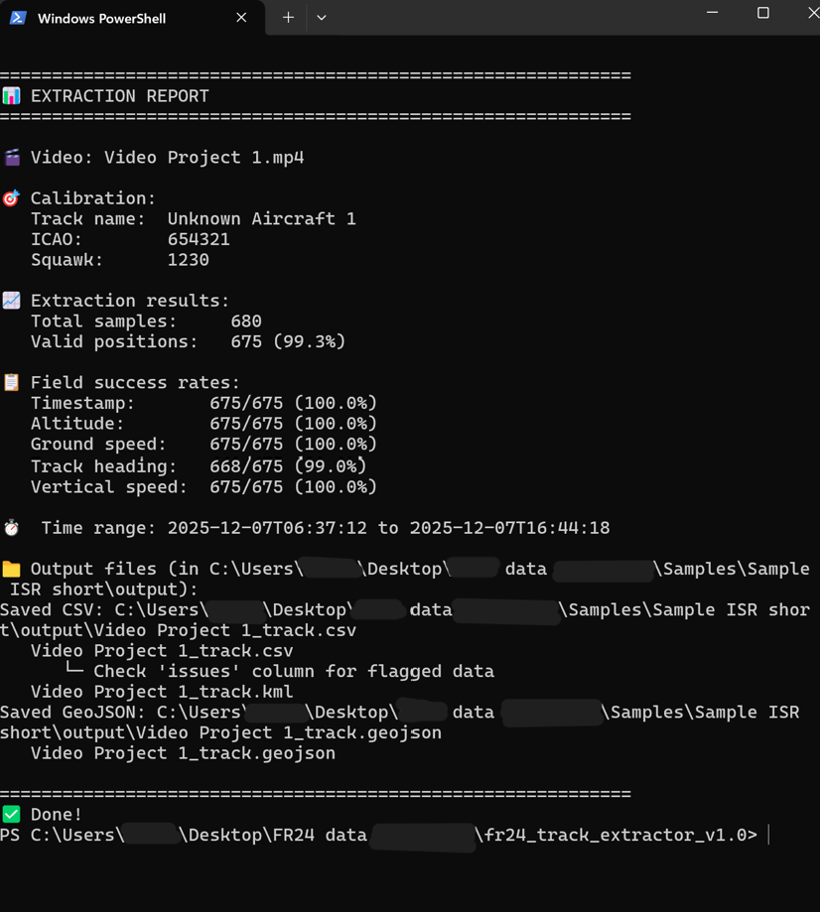
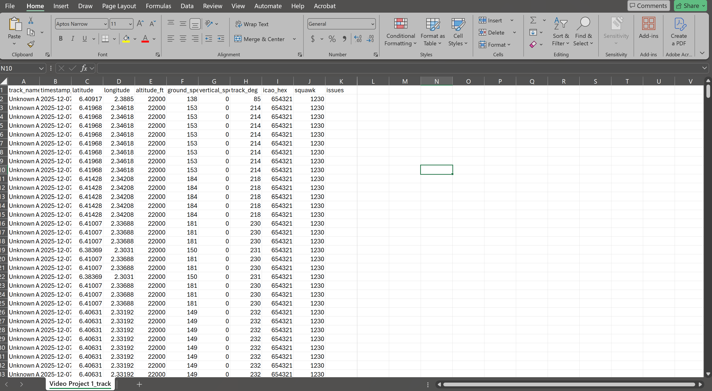

# Flight Track Extractor

Extract aircraft flight tracks from flight tracking platform screen recordings using OCR.


<!-- SCREENSHOT: Hero image - Google Earth with extracted track overlay -->


## Why This Tool?

Flight tracking platforms don't always allow data export - especially for:
- MLAT-only aircraft
- Military flights  
- Filtered/blocked tracks
- Historical playback without subscription

This tool extracts the data directly from your screen recordings using OCR.

## Features

- 🎯 **Grid-based calibration** - Adapts to any screen layout
- 📊 **Multiple output formats** - CSV, KML, GeoJSON
- ✈️ **Complete flight data** - Coordinates, altitude, speed, heading, vertical speed
- 🔄 **Single workflow** - Calibrate and extract in one session

## Installation

### 1. Install Tesseract OCR

| Platform | Command |
|----------|---------|
| **Windows** | Download from [UB-Mannheim](https://github.com/UB-Mannheim/tesseract/wiki) |
| **macOS** | `brew install tesseract` |
| **Linux** | `sudo apt install tesseract-ocr` |

### 2. Install Python packages

```bash
pip install opencv-python numpy pytesseract tqdm
```

### 3. Download this tool

```bash
git clone https://github.com/YOUR_USERNAME/flight-track-extractor.git
cd flight-track-extractor
```

## Usage

### Quick Start

**Windows:**
```powershell
$env:PATH += ";C:\Program Files\Tesseract-OCR"
cd "C:\path\to\flight-track-extractor"
python calibrate.py
```

**Mac/Linux:**
```bash
cd /path/to/flight-track-extractor
python calibrate.py
```

The tool will guide you through the entire process.

### Step-by-Step

#### 1. Paste your video path

<!-- SCREENSHOT: Terminal - video path input prompt -->


**Tip - Copy file path:**
- **Windows:** Shift + Right-click file → "Copy as path"
- **Mac:** Right-click file → Hold Option → "Copy as Pathname"

#### 2. Calibrate field locations

A grid image is generated. Open it and identify each field's cell range.

<!-- SCREENSHOT: Calibration grid image with field locations marked -->


Enter cell ranges like a spreadsheet (e.g., `B45:D45` for latitude):

<!-- SCREENSHOT: Terminal - calibration input -->


**Calibration tips:**
- Select **only the value**, not the label
- Make selection **as narrow as possible** for better accuracy
- Exclude icons/arrows from the selection

#### 3. Proceed with extraction

Type `Y` when prompted to start extraction:

<!-- SCREENSHOT: Terminal - extraction report with emojis -->


## Output

Files are saved in organized subfolders:

```
YourVideoFolder/
├── video.mp4
├── calibration/
│   ├── video_grid.png       ← Reference grid
│   └── video_frame.png      ← Original frame
└── output/
    ├── video_track.csv      ← Data analysis
    ├── video_track.kml      ← Google Earth
    └── video_track.geojson  ← GIS software
```

### CSV Output

<!-- SCREENSHOT: Excel with CSV data -->


| Column | Description |
|--------|-------------|
| track_name | Aircraft identifier |
| timestamp_utc | ISO 8601 format |
| latitude | Decimal degrees |
| longitude | Decimal degrees |
| altitude_ft | Barometric altitude |
| ground_speed_kt | Ground speed in knots |
| vertical_speed_fpm | Climb/descent rate |
| track_deg | Heading in degrees |

### KML in Google Earth

<!-- SCREENSHOT: Google Earth with track displayed -->


**Recommended styling** (Right-click track → Properties → Style):
- Lines: Blue, width 3, opacity 50%
- Area: Filled only, white, opacity 25%

## Recording Tips

For best OCR accuracy:

| Setting | Recommendation |
|---------|----------------|
| Resolution | 1920x1080 or higher |
| Info panel | Keep fully visible |
| Playback speed | 1x (don't speed up) |
| Compression | Low (high quality) |

## Troubleshooting

**Low accuracy on a field?**
- Make the ROI selection narrower
- Exclude nearby icons/arrows
- Check recording quality

**Missing data at start/end?**
- Timeline controls may overlap the info panel
- Try starting recording after playback begins

## Use Cases

- **OSINT Research** - Track analysis for investigative journalism
- **Academic Research** - Flight pattern studies
- **Historical Analysis** - Reconstruct archived flight paths

## How It Works

This tool extracts only what is visually displayed on screen during playback. It does not:
- Access platform APIs or databases
- Bypass any access controls
- Scrape non-visible data

All extraction is performed via OCR on user-recorded screen content.

## License

MIT License - free for any use. See [LICENSE](LICENSE).

## Contributing

Contributions welcome! Please open an issue or pull request.

---

Made for the OSINT community 🔍
